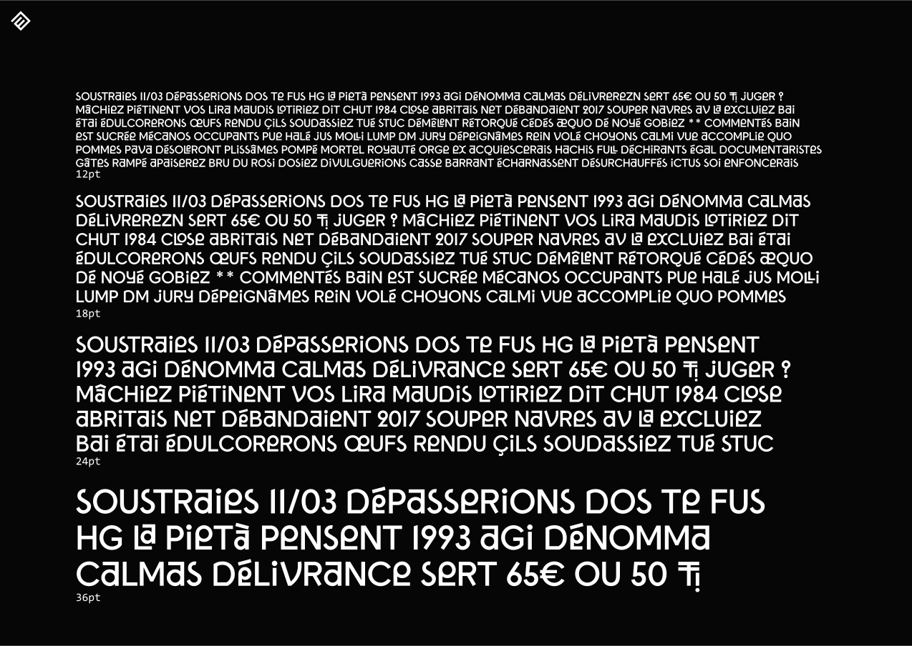

# La Biarnesa

Caractère typographique aux accents béarnais dessiné, conçu et développé par la [Maison des éditions](https://maisondeseditions.fr) avec [Léo Gaullier](https://leogaullier.fr) pour le [Pays de Béarn](https://pays-de-bearn.fr).

 

 

 

 

 

 

 

 

